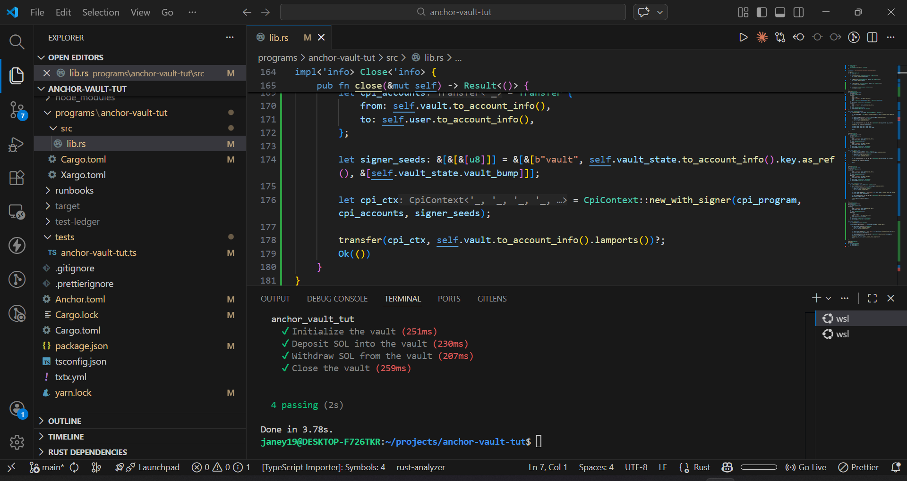

# Buit an Anchor Vault

Completed the Anchor vault assignment from Turbin3

## What Was Done

1. Initialized an empty Anchor program.
2. Wrote all the instructions: Initialize, Deposit, Withdraw, Close.
3. Wrote tests for each instruction.

## Getting Started

```bash
# Install dependencies
yarn install

# Build the program
anchor build

# Deploy the program
solana program deploy target/deploy/anchor_vault_tut.so --use-rpc

# Run tests
anchor test --skip-local-validator --skip-deploy
```

## Tests

All tests passed:


